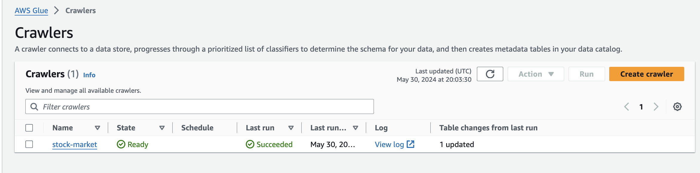

# Stock Market Kafka Real-Time Data Engineering Project
## Introduction:

Executed an End-To-End Data Engineering Project focusing on Real-Time Stock Market Data using Kafka.
## Architecture:

Designed and implemented a robust data pipeline architecture to handle real-time data streaming and processing.

## Technologies Used:

## Programming Language: Python
## Amazon Web Services (AWS):
S3 (Simple Storage Service): Utilized for data storage.
Athena: Employed for querying data stored in S3 using standard SQL.
Glue Crawler: Automated the process of discovering data schema and populating the Glue Data Catalog.
Glue Catalog: Managed and maintained a central metadata repository.
EC2: Deployed virtual servers to run Kafka and other applications.
Apache Kafka: Used as the core messaging system for real-time data ingestion and processing.
Dataset Used:

Implemented a flexible framework that can accommodate various stock market datasets, with a primary focus on the operational side of Data Engineering (building data pipelines).
Key Responsibilities and Achievements:

## Data Ingestion:

Configured and managed Kafka topics to handle high-throughput, low-latency data streams from various stock market sources.
Developed Python scripts to produce and consume real-time data from Kafka topics.

## Data Processing:

Employed AWS Glue for ETL (Extract, Transform, Load) operations to process incoming data.
Designed Glue jobs to transform and load data into S3 for storage and further analysis.

## Data Storage and Querying:

Utilized S3 for scalable and durable storage of processed data.
Configured AWS Athena to enable interactive SQL querying on data stored in S3.
Integrated Glue Data Catalog with Athena to manage metadata and schema evolution efficiently.

## Deployment and Monitoring:

Deployed and managed Kafka on AWS EC2 instances for scalability and reliability.
Implemented monitoring and logging mechanisms to ensure data pipeline reliability and performance.

